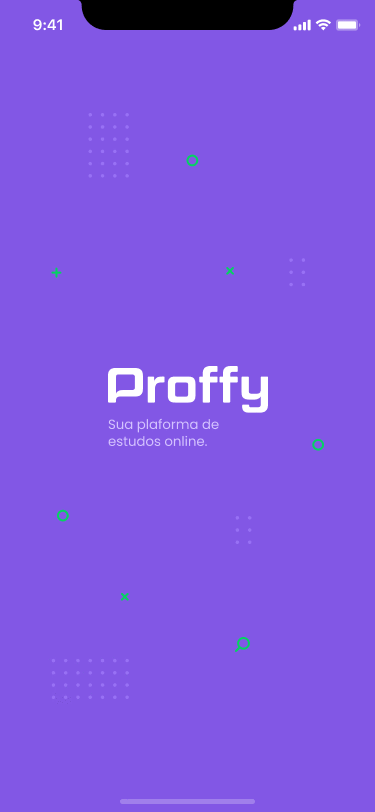

## 💻 Web

  

  <a href="./web/README.md">Mais detalhes</a>

## 📱 Mobile

  

  <a href="./mobile/README.md">Mais detalhes</a>

## 📦 API

  <a href="./server/README.md">Mais detalhes</a>

## :bug: Problemas

Fique a vontade **para criar uma nova issue** com o respectivo titulo e descrição na página de issues do [Proffy](https://github.com/ErickCReis/Proffy/issues) Repositorio. Se você já encontrou a solução para o problema, **Eu amaria fazer o review do seu pull request**!

## :tada: Contribuindo

Confira a página de [contribuição](./CONTRIBUTING.md) para ver como começar uma discução e começar a contribuir.

## :closed_book: Licença

Lançado em 2020

Made with love by [Erick Reis](https://github.com/ErickCReis) 🚀.
Esse projeto esta sobre [MIT license](./LICENSE).
